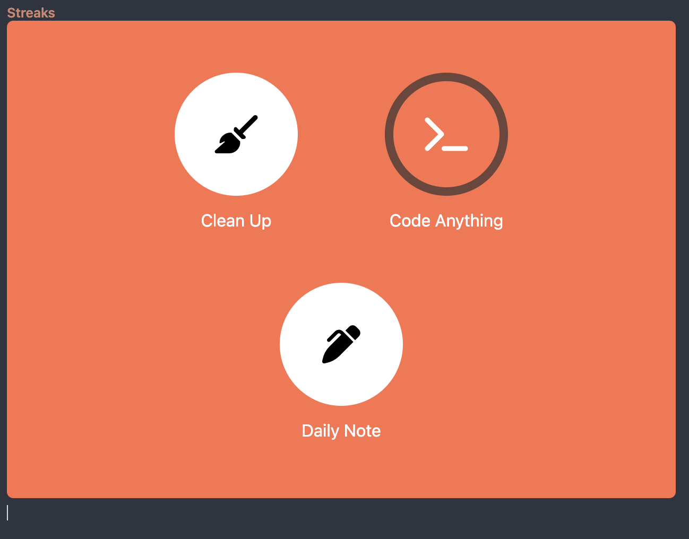

# streaks-api
[](https://github.com/konstfish/streaks-api/actions/workflows/publish.yml)

Made for [Streaks](https://streaks.app/) to easily display completed tasks in an embeddable iframe.



## Shortcut to export streaks
https://www.icloud.com/shortcuts/ff9b3e45effd49ddac8e0ba91b61543e


## Deployment
```
docker pull ghcr.io/konstfish/streaks-api:latest
```

```yaml
version: '3.7'
services:
  streaks_api:
    image: ghcr.io/konstfish/streaks-api:latest
    ports:
      - 4000:4000
    volumes:
      - streaks_data:/opt/data
    environment:
      - REQ_KEY=key
    restart: always

volumes:
  streaks_data:
```

## Api Overview
### /streaks?key=asdf [PUSH]
Accepts a Streaks backup as CSV (streaks_csv in request body)

### /streaks-day/2023-11-19?key=asdf [GET]
Returns a Streaks-like view of the completed tasks from that day

iframe example for obsidian templates: 
`<iframe src="https://obsidian.konst.fish/streaks-day/{{date:YYYY-MM-DD}}?key=asdf" title="Streaks" width="100%" height="450px" style="border-radius: 6px; scollbar: hidden;"></iframe>`

#### Parameters
key: key defined in env
theme: theme to use, supports the same themes as streaks: `['orange', 'pink', 'yellow', 'purple', 'green', 'hotpink', 'blue', 'red', 'lightgreen', 'cyan', 'darkred', 'brown', 'navy', 'darkgreen', 'gray', 'darkgray', 'random']`

### /api/streaks-day/2023-11-19?key=asdf [GET]
The same but as json

## Missing Icons
Streak's icons are not publicly available, so they are replaced with FontAwesome icons as seen in [icon_translation.json](./icon_translation.json). Search for icon replacements here: https://fontawesome.com/v5/search?q=run&m=free & feel free to open a pull request with your additions.